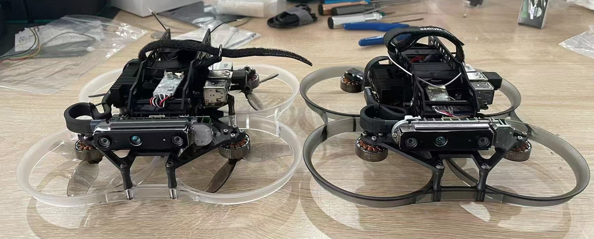
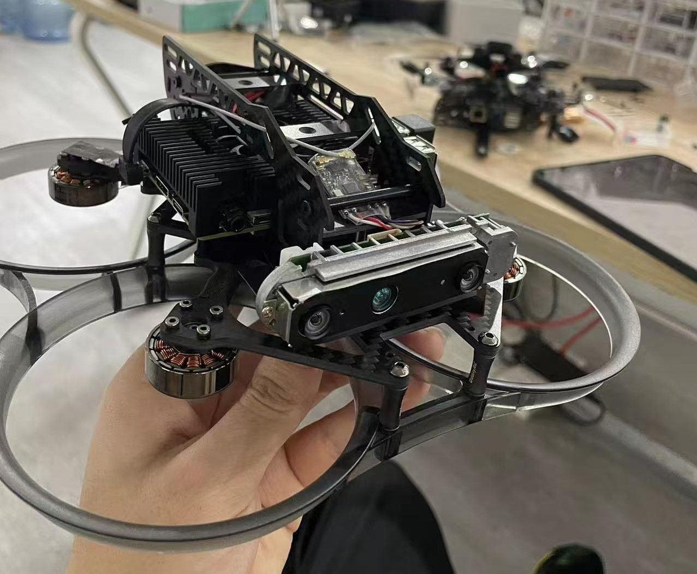

# TianFly
An open source hardware solution for drone navigation,which is based on Fast-drone-250

## Overview
The autonomous drone has a wheelbase of 3.5 inches, with material costs around 4000 RMB(if you live in China), and consists entirely of ready-made components. It features propeller guards and a top-mounted battery. The frontal view is a regular triangular structure, which effectively protects valuable sensors and computing units, significantly reducing the costs associated with drone crashes. The total weight is approximately 650g, with a flight duration of about 8 and a half minutes. It can easily complete autonomous navigation planning tasks while balancing experimental costs and safety.

## List for purchase in China(Taobao)
【腾讯文档】【开源】个人最满意的科研飞机——TianFly
https://docs.qq.com/sheet/DY2hXQXZRa0pmUGpl

## Flying And Navigation Test Video 
- <a href="https://www.bilibili.com/video/BV1SM411Z76H/?share_source=copy_web&vd_source=7b01d34d2559e7724da23dc510cf1bf2">【TianFly初代导航测试视频】  Navigation Test </a>
- <a href="https://www.bilibili.com/video/BV1VK4y1B7Rb/?share_source=copy_web&vd_source=7b01d34d2559e7724da23dc510cf1bf2">【开源】TianFly的玩弄与测试】All kinds of test </a>

## Pictures

## Other
.img is here：
- <a href="https://pan.baidu.com/s/12DPTXrnVhUrsOjCbikLacw?pwd=TUAV">百度云 CN</a>

Google Drive: To Be Continued

## Acknowledgments

I would like to thank everyone who contributed to this project.

Special thanks to:

- [Fast-Drone-250](https://github.com/ZJU-FAST-Lab/Fast-Drone-250) - for their contributions to the navigation algorithm and code
- ChengboWei - for designing an initial framework for the first-generation version.
- [KelvinLauMiau](https://github.com/KelvinLauMiau) - for continuous optimization
- [Tianbot](https://github.com/tianbot) - for providing resources and support when I was in Xi'an
